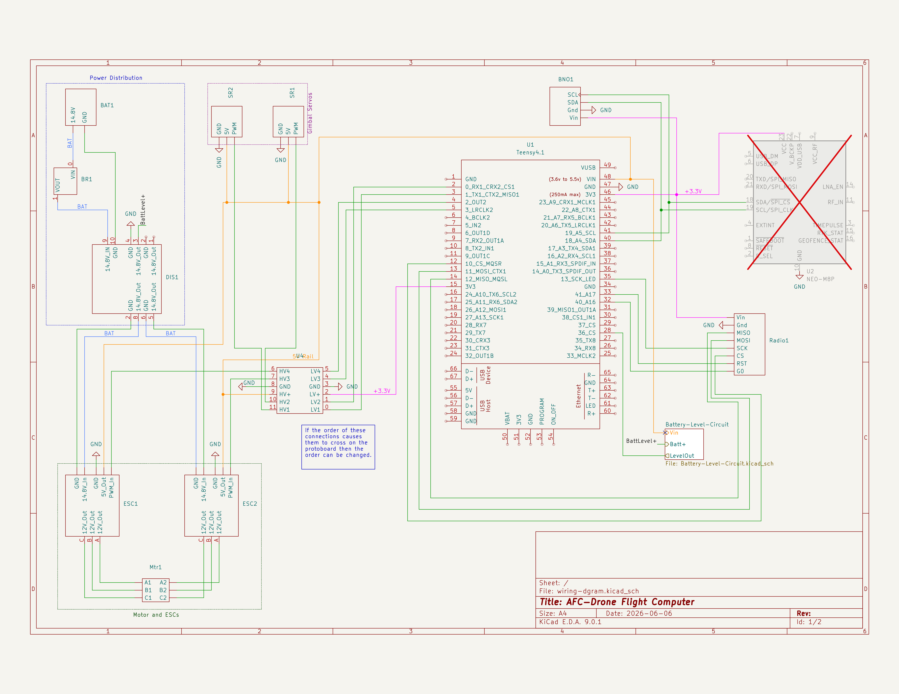

# Aeronautics and Rocketry Enterprise at Michigan Technological University

## Keweenaw Propulsion Laboratory — AFC Drone

## Project Goal

The AFC Drone is an autonomous electric test vehicle developed by the Keweenaw Propulsion Laboratory.

The goal of the project is to create a safe and reusable platform for developing technologies that may later be applied to a self-guided rocket. Because testing guidance and control systems on a liquid-fueled rocket presents significant safety and operational risks, the project begins with an electrically powered propeller vehicle.

The drone allows the team to develop and test:

* Radio communication with a ground station
* Flight-computer startup and fault handling
* Sensor initialization and orientation tracking
* Thrust and gimbal control
* Autonomous guidance algorithms
* Telemetry and command protocols
* Hardware-in-the-loop and ground testing procedures

The project is still under active development. The startup architecture and subsystem interfaces are in place, while the full flight-control and periodic telemetry logic are still being integrated.

---

## Code Structure

The flight software is divided into several subsystem-focused modules.

| Module           | Responsibility                                                                                 |
| ---------------- | ---------------------------------------------------------------------------------------------- |
| `main.cpp`       | Arduino entry point and timing for the main control loop                                       |
| `drone.h/.cpp`   | Top-level drone state machine, startup sequence, target selection, and vehicle coordination    |
| `radio.h/.cpp`   | RFM69 initialization, ground-station connection, command reception, and telemetry transmission |
| `gyro.h/.cpp`    | BNO08x IMU initialization and quaternion-to-Euler conversion                                   |
| `gimbal.h/.cpp`  | Gimbal servo control, mechanical correction, and position interpolation                        |
| `error.h/.cpp`   | Error storage and system fault reporting                                                       |                    |
| `configs.h/.cpp` | Versioned persistent settings in EEPROM: load, validate, migrate, and apply configuration      |

The `Drone` class coordinates the individual subsystems and tracks the overall state of the vehicle.

For the binary USB and RFM69 endpoint reference used by dashboard clients, see
[Dashboard Protocol Reference](docs/dashboard-protocol.md).

---

## System States

The drone uses a state machine to control startup and operation.

| State          | Description                                                         |
| -------------- | ------------------------------------------------------------------- |
| `BOOT`         | Initializes the controller and checks for a USB serial connection   |
| `RADIO_SETUP`  | Initializes the RFM69 and waits for the ground station              |
| `SENSOR_SETUP` | Initializes the IMU and other sensors                               |
| `READY_ARMED`  | Startup is complete and the vehicle is ready for further commands   |
| `FLIGHT`       | The vehicle is allowed to perform flight operations                 |
| `FAULT_ERROR`  | A startup or runtime error has placed the system into a fault state |

The vehicle advances through these states in order. A failure during radio or sensor initialization moves the system into `FAULT_ERROR`.

---

## Startup Control Flow

The Arduino `setup()` function repeatedly calls `Drone::startup()` until the vehicle reaches `READY_ARMED`.

### 1. Boot and Debug Connection

The flight controller first configures the status LED and checks for a USB serial connection.

The current configuration does not wait for a Serial connection. This means startup progresses regardless of a outside connection. The vehicle will then sit idle in `READY/ARMED` until instructed otherwise. 

Persistent configuration is implemented. Settings are stored in EEPROM, loaded during startup, and can be changed at runtime over USB or radio without rebuilding the firmware. See [Persistent Configuration](#persistent-configuration).

### 2. Radio Initialization

After the boot checks are complete, the drone enters `RADIO_SETUP`.

The radio setup sequence:

1. Resets the RFM69 module.
2. Initializes the RadioHead driver.
3. Configures the radio for 915 MHz.
4. Applies the shared encryption key.
5. Configures the high-power transmitter for 20 dBm.
6. Sends the `AFCDrone` connection identifier.
7. Waits for an acknowledgment from the ground station.

If an acknowledgment is not received within one second, the connection attempt is retried.

No flight or sensor setup is intended to occur until communication with the ground station has been established.

### 3. Sensor Initialization

After the radio connection is complete, the drone enters `SENSOR_SETUP`.

The current sensor setup initializes the BNO08x inertial measurement unit over I²C and enables the stabilized rotation-vector report at 100 Hz.

Planned or partially implemented initialization tasks include:

* Gyroscope and IMU startup
* Orientation-report configuration
* Gimbal setup and self-test
* Servo actuation checks
* GPS startup and warmup

GPS support is currently planned but is not enabled in the startup sequence.

### 4. Ready State

When all required sensors report that setup is complete, the drone enters `READY_ARMED`.

At this point:

* Radio configuration is complete.
* The ground station has acknowledged the vehicle.
* Required sensors have initialized.
* The controller is ready to begin higher-level operation.

Entering `READY_ARMED` does not automatically begin flight. A separate transition is expected before the vehicle enters the `FLIGHT` state.

---

## Main Control Loop

The main loop is designed to run at approximately **1 kHz**, giving each cycle a target period of 1,000 microseconds.

Each loop is intended to perform the following work:

1. Receive and process radio commands.
2. Read and update sensor data.
3. Run stabilization and guidance calculations.
4. Select the active command target.
5. Update the gimbal and motor outputs.
6. Queue telemetry for the ground station.
7. Update error and status indicators.
8. Record loop timing information.
9. Wait until the 1,000-microsecond loop period has elapsed.

The timing system tracks values such as:

* Last loop execution time
* Worst observed loop time
* Best observed loop time
* Rolling average loop time

The current `Drone::update()` function is a placeholder. The subsystem update calls and flight-control calculations are expected to be added there as development continues.

---

## Command Targets

The current control architecture provides two command target slots.

A command from the ground station can:

* Update one target slot
* Select which target slot is active
* Set the requested gimbal X position
* Set the requested gimbal Y position
* Set two motor-speed targets

This allows the ground station to prepare a new target separately and then switch the active target.

Gimbal commands are transmitted as signed integer values and converted to degrees by the flight controller. The gimbal mechanism currently operates over an approximately ±20-degree commanded range.

The motor and roll-control portions of the command interface are still being completed.

---

## Radio and Telemetry

The drone uses an RFM69 radio operating at 915 MHz.

Normal radio messages contain:

* A packet sequence number
* A message-type identifier
* An 8-byte payload

Defined message categories include:

* General system status
* Gimbal and actuator status
* Orientation quaternion
* Acceleration
* Velocity
* Position
* GPS coordinates
* Ground-station commands
* Configuration data

General system telemetry is intended to report:

* Average loop time
* Maximum loop time
* Vehicle runtime
* Radio signal strength
* Current drone state

Several telemetry messages are defined but are not yet fully populated by the current firmware.

See the Radio API documentation for the detailed packet and payload definitions.

---

## Persistent Configuration

Configuration values are retained in EEPROM and are loaded during startup. All
configuration commands use a signed 32-bit integer value; boolean values use
`0` for disabled and `1` for enabled. A value outside its accepted range is
rejected with `INVALID_VALUE`. Configuration changes are rejected while the
vehicle is in `FLIGHT`.

### Format Version and Migration

The stored image starts with a magic value, a format version, and a checksum.
`config_load()` accepts it only when all three are valid for the current
`CONFIG_VERSION`:

| Stored image | Result |
| --- | --- |
| Magic, version, and checksum all valid | Loaded as-is |
| Version differs from `CONFIG_VERSION` | `config_migrate()` runs |
| Version matches but the checksum fails | Reset to defaults and re-saved |

`CONFIG_VERSION` is currently `2`. Version 2 added `DebugMode` and moved
`TxPowerDbm` after the boolean settings, which changed both the stored layout
and every wire ID above `0`. `config_migrate()` re-reads a version 1 image
under its original layout, validates it against that layout's own checksum, and
carries the settings forward, so a per-airframe gimbal trim survives the
upgrade instead of needing to be re-measured. An image that fails that
validation falls back to defaults.

Any change to `PersistentConfig` must increment `CONFIG_VERSION` and add a
matching case to `config_migrate()`.

| Key | Current wire ID | Accepted value | Default | Effect |
| --- | ---: | --- | ---: | --- |
| `DebugMode` | 0 | 0 or 1 | 0 | Persisted, but does not yet gate any behavior. |
| `TxPowerDbm` | 1 | 14–20 | 20 | RFM69 transmit power in dBm. |
| `UsbRelayEnabled` | 2 | 0 or 1 | 1 | Enables USB communication handling. |
| `RadioEnabled` | 3 | 0 or 1 | 1 | Enables periodic radio processing. |
| `SkipRadioHandshake` | 4 | 0 or 1 | 1 | Skips the radio connection handshake when enabled. |
| `GimbalPitchOffset` | 5 | 60–120 | 90 | Pitch-servo center/setpoint offset in degrees. |
| `GimbalYawOffset` | 6 | 60–120 | 89 | Yaw-servo center/setpoint offset in degrees. |
| `Motor1Offset` | 7 | −100–100 | 0 | Top-motor speed adjustment. |
| `Motor2Offset` | 8 | −100–100 | 0 | Bottom-motor speed adjustment. |

Wire IDs are the `ConfigKey` enum values and shift whenever a key is inserted.
`CONFIG_VERSION` is bumped in the same change so an out-of-date client is
rejected with `UNKNOWN_VERSION` instead of silently writing the wrong setting.

The USB configuration request uses a 16-bit little-endian key and a 32-bit
little-endian signed value for each entry. A `SET` request can contain up to
nine `{key, value}` entries; the controller applies all valid entries, writes
EEPROM at most once, and replies with one status entry per requested key.

A `READ` request uses the same entry layout, but ignores each entry's value and
can request up to eight keys. The `READ_RESPONSE` contains `{key, status,
value}` for each requested key. Eight read results exactly fill the 60-byte USB
payload limit.

### Radio Configuration Packets

Radio configuration uses `radio_MessageType::CONFIG` (`9`) and carries one
configuration value per 8-byte packet. It uses the same keys, accepted values,
and integer representation listed above.

| Byte | Field | Request meaning |
| ---: | --- | --- |
| 0 | `version` | Must equal `CONFIG_VERSION` (currently `2`). |
| 1 | `state.operation` | `READ` (`1`) or `SET` (`2`). |
| 2–3 | `configKey` | `ConfigKey` as a 16-bit little-endian value. |
| 4–7 | `value` | 32-bit little-endian value. It is ignored for `READ`; it is the requested signed configuration value for `SET`. |

The drone responds using the same `CONFIG` message type. Response byte 1 is a
`ConfigResult` status, and a successful `READ` response returns the current
value in bytes 4–7. Because the radio payload is fixed at eight bytes, batch
configuration is available only over USB; send one radio packet for each
configuration key.

`ConfigOp::ZERO_ALL` (`255`) is reserved in the operation enum but is not
handled on either transport; sending it returns `UNKNOWN_OP`.

---

## Error Handling

Errors are stored in an internal error buffer. Each error contains:

* An error code
* A severity level

Severity levels are defined as:

| Severity | Meaning           |
| -------: | ----------------- |
|      `0` | Low               |
|      `1` | Medium            |
|      `2` | High              |
|      `3` | Critical or fatal |

Current radio initialization errors include:

* Radio driver initialization failure
* Radio frequency configuration failure

An initialization failure moves the drone into `FAULT_ERROR`.

The intended design is for errors to be reported through every available communication interface, including USB serial and the radio. Radio error reporting and persistent internal logging are still under development.

---

## LED Indicators

The status LED patterns provide a visual indication of the current system state.

| Pattern      |         Timing | State          | Meaning                                                                    |
| ------------ | -------------: | -------------- | -------------------------------------------------------------------------- |
| Blink        |         100 ms | `RADIO_SETUP`  | The controller is initializing the radio or waiting for the ground station |
| Blink        |         300 ms | `SENSOR_SETUP` | Radio setup is complete and sensors are being initialized                  |
| Fade         | 2,000 ms cycle | `READY_ARMED`  | Startup is complete and the vehicle is ready                               |
| Double flash | 1,200 ms cycle | `FLIGHT`       | The vehicle is in a flight-capable operating state                         |
| Rapid blink  |          50 ms | `FAULT_ERROR`  | The controller has detected a fault                                        |

The LED behavior has been defined in the flight software, but the periodic call that updates the indicator is still being integrated into the main control loop.

---

## Hardware Layout

The wiring diagram was created using KiCad 9.0 and is maintained in the [AFC Wiring Diagram repository](https://github.com/Keweenaw-Propulsion-Laboratory/AFC-Wiring-Diagram).

---

## Current Development Status

The current firmware includes:

* A structured startup state machine
* USB serial detection and debug output
* RFM69 configuration and connection-handshake logic
* BNO08x IMU initialization
* Quaternion-to-Euler conversion
* Gimbal servo control
* Bilinear interpolation for gimbal correction
* Two command target slots
* Message definitions for commands and telemetry
* Error buffering
* Loop-timing infrastructure
* Versioned persistent configuration in EEPROM, with migration
* Configuration set/read over USB (batched) and radio (single key)
* State-based LED patterns

Work still in progress includes:

* Integrating subsystem updates into `Drone::update()`
* Completing motor control
* Completing roll control
* Scheduling telemetry messages
* Processing live IMU data in the main loop
* Implementing command timeouts and failsafe behavior
* Completing GPS support
* Reporting errors over the radio
* Finalizing the transition from `READY_ARMED` to `FLIGHT`
